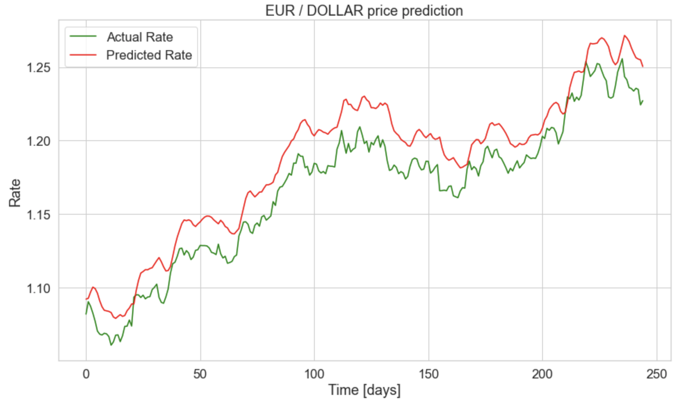

# TF2-LSTM-Currency-Prediction

- An LSTM is a type of recurrent neural network that addresses the vanishing gradient problem in vanilla RNNs through additional cells, input and output gates. Intuitively, vanishing gradients are solved through additional additive components, and forget gate activations, that allow the gradients to flow through the network without vanishing as quickly.

- In this repository, you can find TensorFlow 2 implementation of both CuDNNLSTM and LSTM for GPU and CPU respectively. 



### Step-by-step Installation Instructions

Virtual Environment should be used whenever you work on any Python-based project. It is generally good to have one new virtual environment for every Python-based project you work on. So the dependencies of every project are isolated from the system and each other.

After clonning the repository, please follow the below commands.
```bash
$ pip install virtualenv
$ virtualenv --version
$ cd [where you want to create your environment]
$ python3 -m venv tf2-lstm
$ . tf2-lstm/bin/activate
$ cd [where you want to clonne the repository]
$ git clone https://github.com/CoskunGorkem/TF2-LSTM-Currency-Prediction.git
$ cd OpenCV
$ pip install -r requirements.txt
```

# Source
Understanding LSTM -- a tutorial into Long Short-Term Memory Recurrent Neural Networks
- https://arxiv.org/abs/1909.09586

